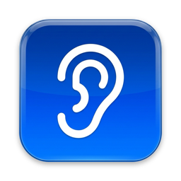
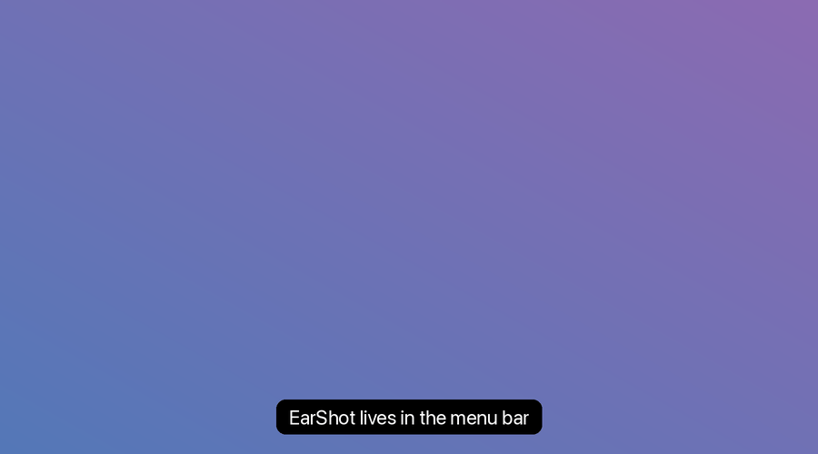

<p align="center"></p>

# EarShot 👂

> 단축키 한 번으로 회의를 녹음해서 원하는 폴더로 보내 주는 맥 메뉴바 앱

[English](README.md) · **한국어**

<p align="center"></p>

슬랙 허들·줌·구글 밋처럼 맥에서 하는 회의를 **상대 목소리(앱 소리)와 내 목소리(마이크)** 둘 다 녹음합니다.
멈추면 메뉴 막대에 변환 진행률을 보여 주고, 끝나면 알림을 보냅니다. 편할 때 알림을 눌러 날짜·주제·참석자를 적으면 칸(예: 회사·개인)별 폴더로 보냅니다. NAS 공유 폴더를 골라 두면 받아쓰기·보관은 원하는 도구로 이어 붙일 수 있습니다.

```
⌃⌥R  ──▶  녹음  ──▶  ⌃⌥R  ──▶  변환 37%  ──▶  알림  ──▶  저장 창(날짜·주제·참석자)  ──▶  [회사] / [개인] / …  ──▶  고른 폴더
```

> [!IMPORTANT]
> **녹음 전에 동의를 받으세요.** 상대 동의 없는 녹음은 사는 곳에 따라 불법일 수 있습니다.
> 회의 참석자에게 녹음한다고 알리고, 현지 법과 소속 조직의 규칙을 따르세요. 앱 사용에 대한 책임은 사용자에게 있습니다.

## 기능

| | |
|---|---|
| 🎙️ **수동 녹음** | `⌃⌥R`(control + option + R) 또는 메뉴 "녹음 시작". 어느 앱을 보고 있든 동작 |
| 🔊 **두 소리를 따로 받아 합치기** | 회의 앱 소리는 Core Audio 프로세스 탭, 내 목소리는 마이크. 끝나면 m4a 하나로 합침 |
| 🧭 **회의 앱 자동 선택** | 마이크를 쓰는 앱 중 회의 앱(Zoom·Slack·Chrome·Safari·Arc·Edge)이 있으면 그 앱 소리만, 없으면 맥 전체 소리 |
| 🎚️ **장치 고르기** | 메뉴 "마이크"(시스템 기본·장치별), "녹음할 소리"(회의 앱 / 맥 전체 / 마이크만) |
| 📊 **소리 막대** | 녹음 중 메뉴에 맥 소리·마이크 레벨. 15초 동안 한쪽이 조용하면 알림 |
| 🔌 **장치가 바뀌어도 이어 녹음** | 이어폰·블루투스를 바꾸면 조각을 나눠 받고 끝날 때 이어 붙임 |
| 🛟 **앱이 죽어도 녹음 보존** | 녹음 중 죽으면 다시 켜질 때 남은 조각을 살려 저장 |
| ⏳ **변환 진행률** | 멈춘 뒤 m4a 로 바꾸는 동안 메뉴 막대에 진행률을 보여 줌(2시간 회의 약 40초) |
| 🗂️ **편할 때 저장** | 회의가 끝나도 창이 화면을 가리지 않고 알림만 옴. 알림(또는 메뉴 "분류 안 됨")을 누르면 저장 창: 날짜·시간(녹음 시작 시각으로 채워짐)·주제·참석자 → 칸 고르기. "나중에"로 미뤄 두면 "분류 안 됨"에 남음 |
| 🏷️ **칸 직접 정하기** | 설정에서 칸 이름 바꾸기·추가(최대 6개)·삭제, 칸마다 폴더 지정 |
| 📤 **안정적인 전송** | 폴더가 안 붙어 있으면(예: NAS 볼륨) 보류함에 두고 60초마다·볼륨이 붙을 때 다시 보냄. 같은 이유로 5번 실패한 파일은 "보내지 못한 파일"로 따로 뺌 |
| 🚀 **로그인 시 실행** | 맥을 켜면 자동으로 켜지고, 앱이 죽으면 다시 켜짐(메뉴 "종료"로 끈 건 다시 안 켬) |
| 🌐 **한국어·영어** | macOS 언어 설정을 따름 |

30초보다 짧은 녹음은 버립니다.

## 파일 이름

```
2026-10-02-1249-Zoom-주간 회의-참석 철수,영희.m4a
└── 시작 시각 ──┘ └앱┘ └주제┘ └─ 참석자 ─┘
```

`/ : \ * ? " < > |` 같은 글자는 빼고, 이름이 200바이트를 넘으면 줄입니다. 같은 이름이 있으면 `-2`, `-3` 을 붙입니다.
참석자를 이름에 넣어 두면 받아쓰기 스크립트 같은 뒤 단계 도구가 읽어 쓸 수 있습니다.

## 저장 위치

| 위치 | 무엇 |
|---|---|
| `~/Documents/EarShot/<칸>` | 칸별 기본 보낼 곳. 설정(메뉴 "저장 위치…")에서 NAS 공유 폴더 등 아무 폴더로 바꿀 수 있음 |
| `~/Library/Application Support/EarShot/Recording/` | 녹음 중인 조각(.caf) |
| `~/Library/Application Support/EarShot/Pending/` | 녹음이 끝나고 분류를 기다리는 m4a |
| `~/Library/Application Support/EarShot/Outbox/<칸>/` | 보내기를 기다리는 파일(메뉴 "보낼 대기") |
| `~/Library/Application Support/EarShot/Outbox/실패/` | 보내지 못한 파일(메뉴 "보내지 못한 파일") |
| `~/Library/Logs/EarShot/detect.log` | 앱 기록(메뉴 "감지 로그 열기") |

홈 폴더 안의 폴더는 없으면 자동으로 만듭니다. 외장·네트워크 볼륨(`/Volumes/…`)과 클라우드 동기화 폴더(`~/Library/CloudStorage/…`)는 만들지 않고 붙을 때까지 기다립니다.

## 설치

공증된 배포 파일은 없고 소스로만 공개합니다. 직접 빌드하세요.

필요한 것: macOS 14.2+, Xcode, [XcodeGen](https://github.com/yonaskolb/XcodeGen)(`brew install xcodegen`)

```sh
git clone https://github.com/yootaebong/earshot.git
cd earshot
xcodegen generate
xcodebuild -project EarShot.xcodeproj -scheme EarShot -configuration Release -derivedDataPath build build
cp -R build/Build/Products/Release/EarShot.app /Applications/
open /Applications/EarShot.app
```

### 서명

`project.yml` 은 로그인 키체인의 자체 서명 인증서 **`EarShot Local Signing`** 으로 서명합니다.
임시(ad-hoc) 서명은 빌드할 때마다 마이크·시스템 오디오 권한이 풀리기 때문입니다. 새 맥에서는 한 번 만들어 둡니다.

```sh
cat > /tmp/c.cnf <<'CNF'
[req]
distinguished_name=dn
x509_extensions=ext
prompt=no
[dn]
CN=EarShot Local Signing
[ext]
basicConstraints=critical,CA:false
keyUsage=critical,digitalSignature
extendedKeyUsage=critical,codeSigning
CNF
openssl req -x509 -newkey rsa:2048 -nodes -keyout /tmp/k.pem -out /tmp/c.pem -days 3650 -config /tmp/c.cnf
openssl pkcs12 -export -legacy -inkey /tmp/k.pem -in /tmp/c.pem -out /tmp/c.p12 -passout pass:earshot
security import /tmp/c.p12 -k ~/Library/Keychains/login.keychain-db -P earshot -T /usr/bin/codesign
rm /tmp/c.cnf /tmp/k.pem /tmp/c.pem /tmp/c.p12
```

인증서 없이 빌드하려면 `xcodebuild` 에 `CODE_SIGN_IDENTITY="-"` 를 붙입니다(빌드할 때마다 권한을 다시 줘야 합니다).

## 권한

처음 녹음할 때 두 번 묻습니다. 둘 다 **허용**해야 합니다.

- **마이크**: 내 목소리
- **시스템 오디오 녹음**: 회의 앱 소리. 이 권한이 없으면 오류 없이 무음만 녹음됩니다

## 문제 해결

| 증상 | 확인할 것 |
|---|---|
| 상대 목소리가 안 들어감 | 시스템 설정 → 개인정보 보호 및 보안 → 화면 및 시스템 오디오 녹음에서 EarShot 허용 |
| 내 목소리가 안 들어감 | 메뉴 "마이크"에서 쓰는 장치를 고르고, 녹음 중 메뉴의 마이크 막대가 움직이는지 확인 |
| 폴더에 안 보임 | 보낼 폴더의 볼륨이 붙어 있는지, 메뉴 "보낼 대기"·"보내지 못한 파일" 확인 |
| 단축키가 안 먹음 | 다른 앱이 `⌃⌥R` 을 쓰는지 확인. 메뉴 "녹음 시작"은 항상 동작 |
| 그 밖에 | 메뉴 "감지 로그 열기" |

## 구조

| 파일 | 역할 |
|---|---|
| `App/EarShotApp.swift` | 메뉴바·단일 인스턴스 잠금 |
| `App/RecordingController.swift` | 녹음 시작·멈춤, 조각 나누기, 복구, m4a 합치기 |
| `App/AppAudioTap.swift` | Core Audio 프로세스 탭으로 앱·맥 소리 받기 |
| `App/MicRecorder.swift` | AVAudioEngine 으로 마이크 받기 |
| `App/MicMonitor.swift` | 마이크를 쓰는 앱(회의 앱) 감지, 로그 |
| `App/SaveWindow.swift` | 저장 창과 분류 대기열 |
| `App/Delivery.swift` | 전송·재전송·파일 이름 |
| `App/Settings.swift` | 칸·저장 위치·마이크·녹음할 소리 설정 |
| `App/LoginItem.swift` | LaunchAgent 로그인 실행·자동 재시작 |
| `App/GlobalHotKey.swift` | 전역 단축키 |
| `App/AudioCapturePermission.swift` | 시스템 오디오 녹음 권한 요청 |
| `App/Localizable.xcstrings` | 한국어·영어 문구 |

## 라이선스

[MIT](LICENSE)
